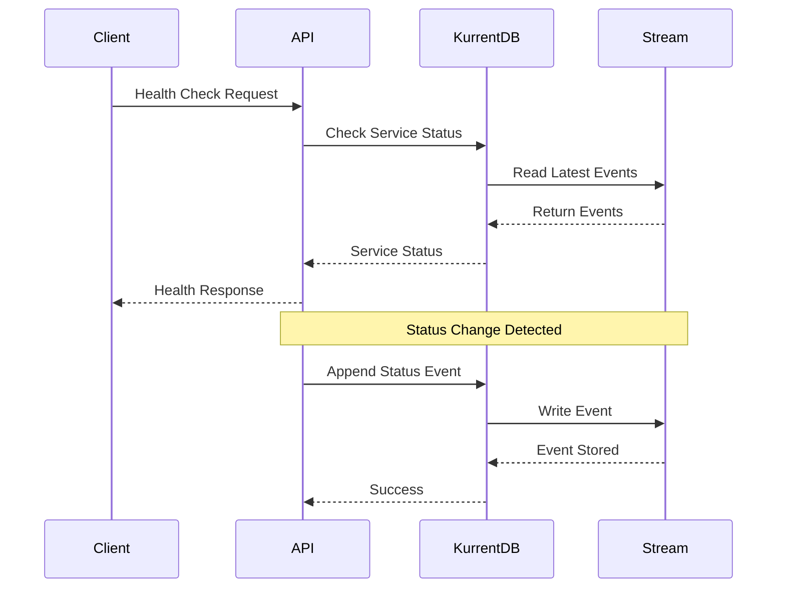
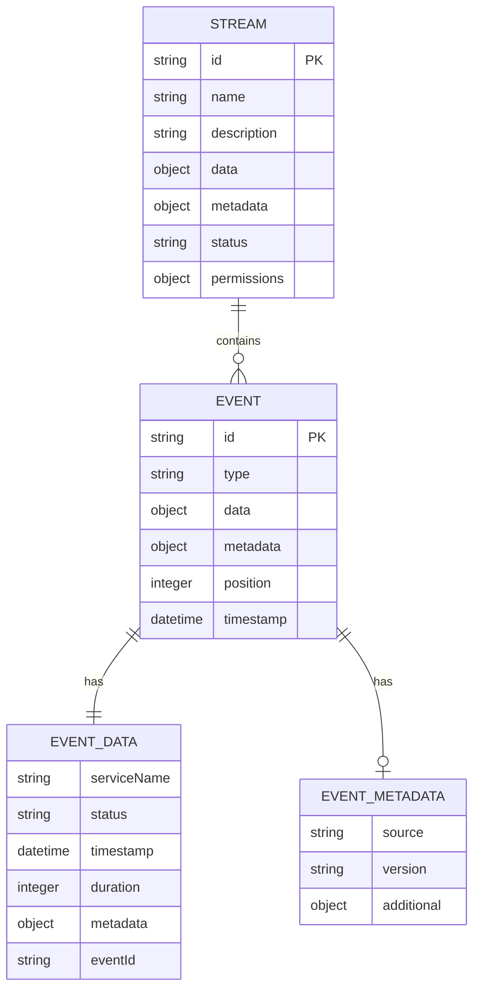
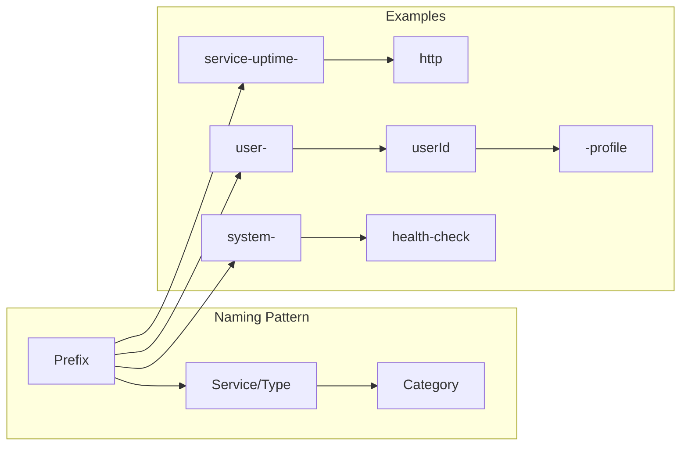
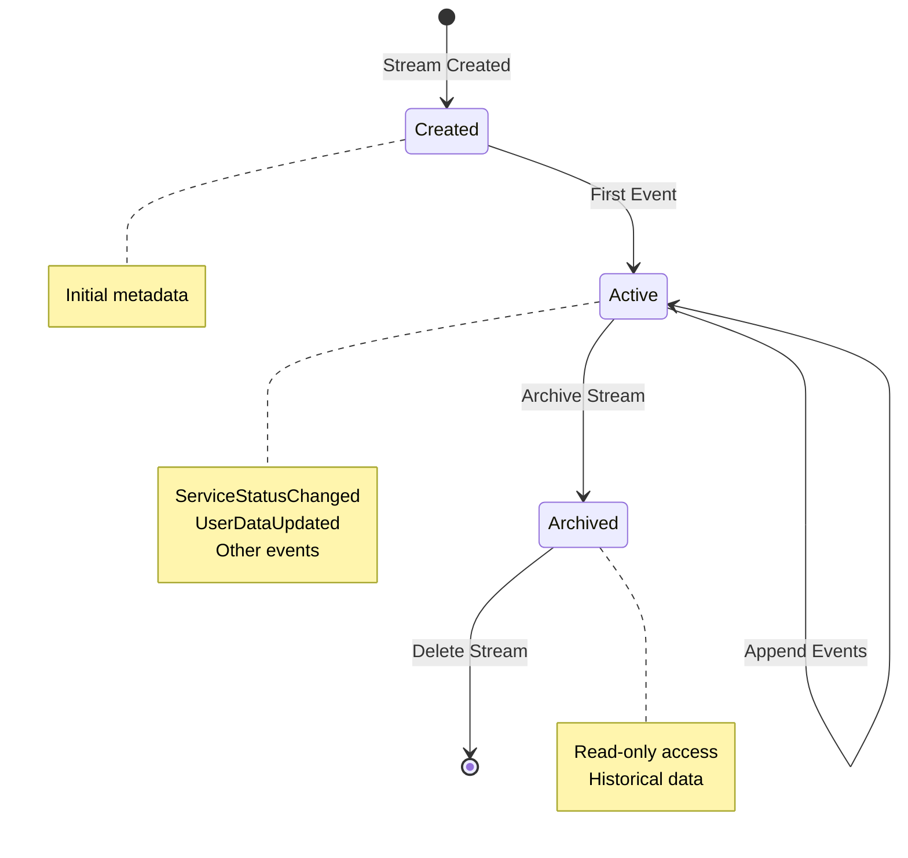
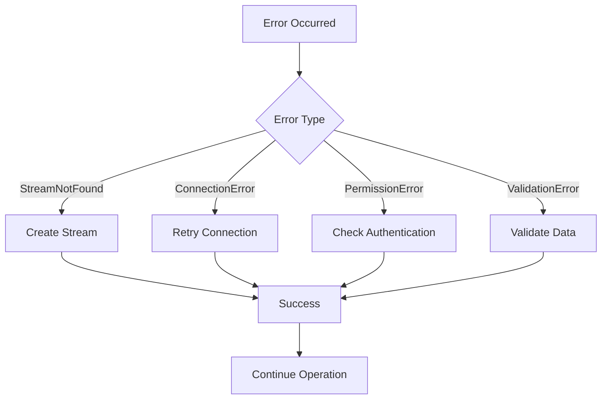

# KurrentDB Stream Architecture

## Visual Overview

```mermaid
graph TB
    subgraph "Penguin Pool Backend"
        API[HTTP API Server]
        WS[WebSocket Server]
        DB[KurrentDB Service]
    end

    subgraph "KurrentDB Event Store"
        subgraph "Service Uptime Streams"
            HTTP_STREAM[service-uptime-http]
            WS_STREAM[service-uptime-websocket]
            DB_STREAM[service-uptime-database]
        end

        subgraph "User Data Streams"
            USER_PROFILE[user-{userId}-profile]
            USER_PREFS[user-{userId}-preferences]
            USER_ACTIVITY[user-{userId}-activity]
            USER_LOANS[user-{userId}-loans]
            USER_OFFERS[user-{userId}-offers]
        end

        subgraph "System Streams"
            HEALTH_CHECK[system-health-check]
            CONN_TEST[connection-test]
        end
    end

    subgraph "Event Types"
        STATUS_CHANGED[ServiceStatusChanged]
        USER_UPDATED[UserDataUpdated]
    end

    API --> HTTP_STREAM
    WS --> WS_STREAM
    DB --> DB_STREAM

    API --> USER_PROFILE
    API --> USER_PREFS
    API --> USER_ACTIVITY
    API --> USER_LOANS
    API --> USER_OFFERS

    DB --> HEALTH_CHECK
    DB --> CONN_TEST

    HTTP_STREAM --> STATUS_CHANGED
    WS_STREAM --> STATUS_CHANGED
    DB_STREAM --> STATUS_CHANGED

    USER_PROFILE --> USER_UPDATED
    USER_PREFS --> USER_UPDATED
    USER_ACTIVITY --> USER_UPDATED
    USER_LOANS --> USER_UPDATED
    USER_OFFERS --> USER_UPDATED

    HEALTH_CHECK --> STREAM_CREATED
    CONN_TEST --> STREAM_CREATED
```

## Stream Data Flow



## Event Schema Relationships



## Stream Naming Convention



## Access Control Matrix

| Stream Type        | Read Access | Write Access | Admin Access |
| ------------------ | ----------- | ------------ | ------------ |
| `service-uptime-*` | system      | system       | system       |
| `user-{userId}-*`  | userId      | userId       | userId       |
| `system-*`         | system      | system       | system       |

## Event Lifecycle



## Performance Characteristics

### Event Throughput

- **Uptime Streams**: ~60 events/hour per service
- **User Streams**: Variable (0-1000 events/hour)
- **System Streams**: Minimal (0-10 events/hour)

### Storage Growth

- **Uptime Events**: ~1KB per event
- **User Events**: ~5-50KB per event
- **System Events**: ~1KB per event

### Read Patterns

- **Real-time Monitoring**: Latest events
- **Historical Analysis**: Full stream reads
- **User Queries**: Filtered reads by user

## Error Handling



---

_This architecture diagram shows the complete stream structure and data flow for the Penguin Pool backend service._
